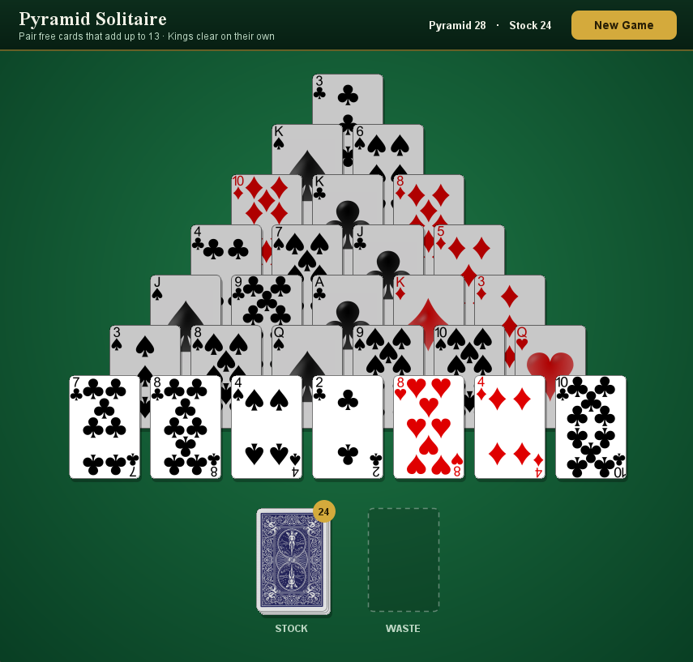

# Pyramid Solitaire

A desktop version of the classic Pyramid Solitaire card game, written in Java with Swing.

## Controls

| Action | How |
|---|---|
| Select a card | Click a free card in the pyramid |
| Remove a pair | Select one card, then click a second card that adds up to 13 |
| Remove a King | Click a free King |
| Draw a card | Click the stock pile |
| Use the waste card | Click the waste card, then click a free pyramid card that adds up to 13 with it |
| Deselect | Click an empty area of the table |
| Start over | Click **New Game** |

## Features

- Overlapping pyramid layout with rounded cards and drop shadows
- Free cards glow on hover; covered cards are dimmed
- Live count of cards left in the pyramid and the stock
- Win and loss screens shown in the window, with one click to deal again
- Automatic detection of when no moves are left

## Getting Started

### Requirements

- Java 8 or later

## Project Structure

| File | Purpose |
|---|---|
| `card.java` | A single card: rank, suit, image loading, and drawing |
| `deck.java` | Builds and shuffles a standard 52-card deck |
| `PyramidSolitaireGame.java` | Game state and rules: the pyramid, stock, waste, and legal moves |
| `PyramidSolitaireGUI.java` | The Swing window: drawing, mouse input, and win/loss detection |

The game logic lives in `PyramidSolitaireGame` and doesn't depend on the interface, so the rules can be tested or reused separately from the GUI.

## Credits

Card images: here([url](https://opengameart.org/content/playing-cards-vector-png))
